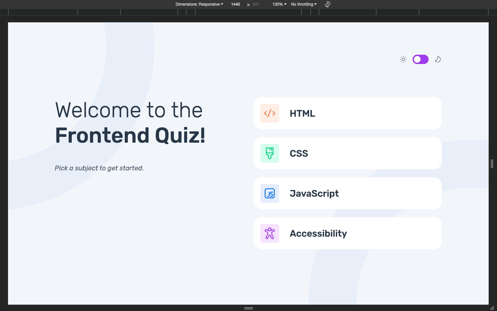
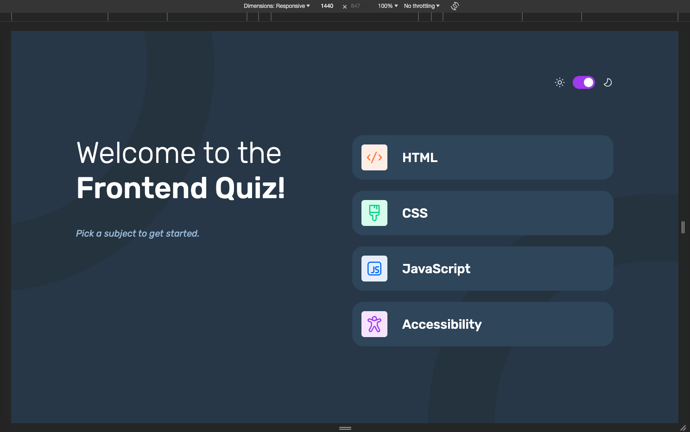
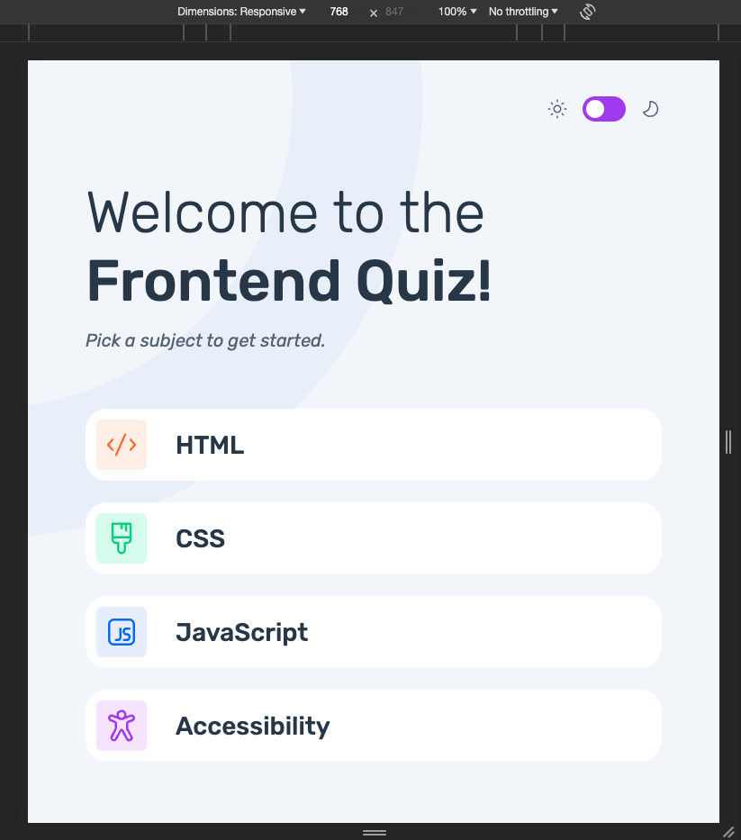
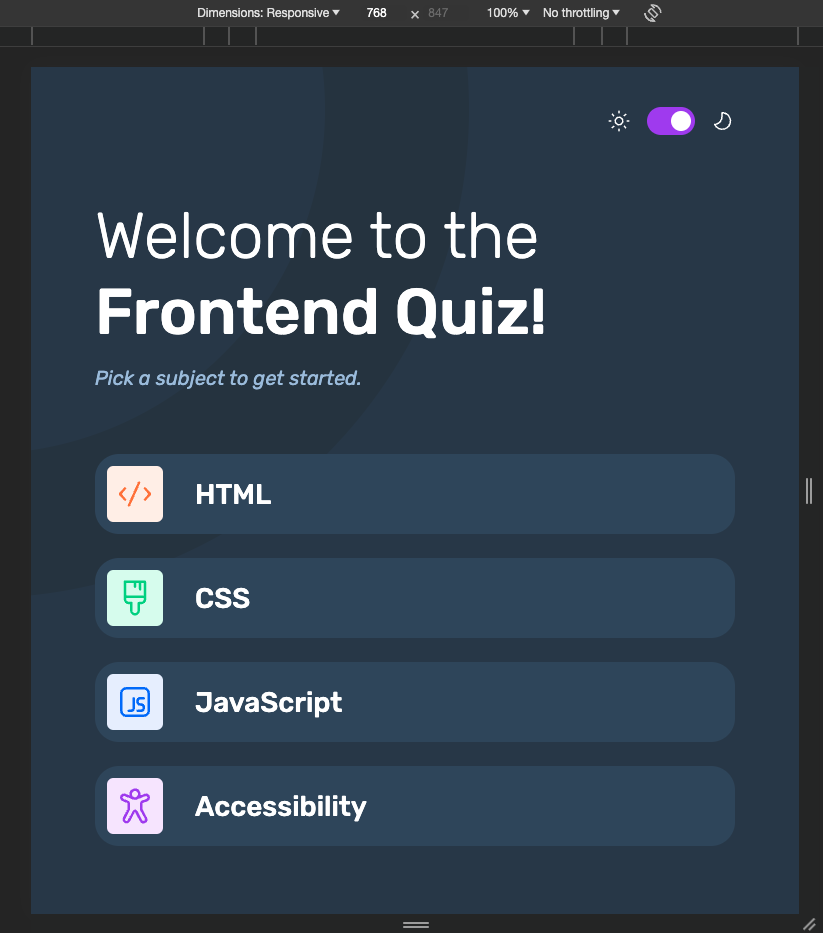
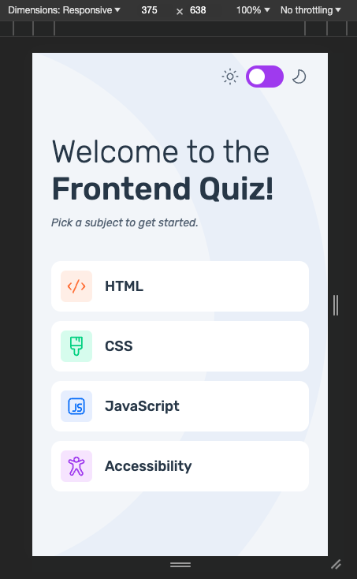
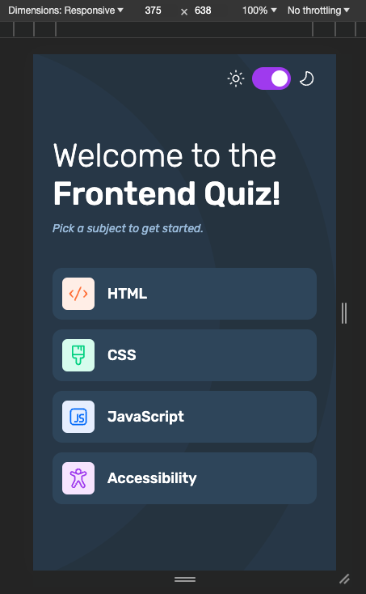

# Frontend Mentor - Frontend quiz app solution

This is a solution to the [Frontend quiz app challenge on Frontend Mentor](https://www.frontendmentor.io/challenges/frontend-quiz-app-BE7xkzXQnU). Frontend Mentor challenges help you improve your coding skills by building realistic projects.

## Table of contents

- [Overview](#overview)
  - [The challenge](#the-challenge)
  - [Screenshot](#screenshot)
  - [Links](#links)
- [My process](#my-process)
  - [Built with](#built-with)
  - [What I learned](#what-i-learned)
- [Author](#author)

## Overview

This project represents an interactive web page with a quiz where users can select answers based on the presented question.

### The challenge

Users should be able to:

- Select a quiz subject
- Select a single answer from each question from a choice of four
- See an error message when trying to submit an answer without making a selection
- See if they have made a correct or incorrect choice when they submit an answer
- Move on to the next question after seeing the question result
- See a completed state with the score after the final question
- Play again to choose another subject
- View the optimal layout for the interface depending on their device's screen size
- See hover and focus states for all interactive elements on the page
- Change the app's theme between light and dark

### Screenshot

#### Desktop version - Light

#### Desktop version - Dark

#### Tablet version - Light

#### Tablet version - Dark

#### Mobile version - Light

#### Mobile version - Dark

### Links

- Solution URL: [Solution URL here](https://github.com/AlinaAlexandraVizireanu/frontend-quiz-app)
- Live Site URL: [Live site URL here](https://alinaalexandravizireanu.github.io/frontend-quiz-app/)

## My process

I started this project by checking the design on the Figma file, then I created the website's structure with HTML and then used CSS to implement the style. To create the layout I used Flexbox mainly. The logic part of the application was built with JavaScript where I had to make the web page as dynamic as required so that there was no need to implement additional HTML web pages. For the required data I used the provided data.json file and axios to get the data on the web page.

### Built with

- Semantic HTML5 markup
- CSS custom properties
- Flexbox
- JavaScript
- Axios

### What I learned

The process of building this web page was a bit challenging, but it helped me to consolidate my JavaScript knowledges.

## Author

- Website - [Alina Alexandra Vizireanu](https://alinaalexandravizireanu.github.io/frontend-quiz-app/)
- Frontend Mentor - [@AlinaAlexandraVizireanu](https://www.frontendmentor.io/profile/AlinaAlexandraVizireanu)
